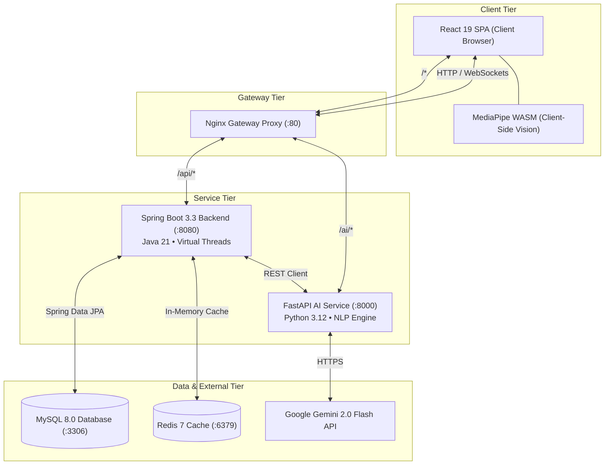

<div align="center">

# InterviewIQ 🎯
### Enterprise-Ready AI Mock Interview & Resume Intelligence Platform

[](https://react.dev/)
[](https://spring.io/projects/spring-boot)
[](https://openjdk.org/projects/jdk/21/)
[](https://fastapi.tiangolo.com/)
[](https://www.python.org/)
[](https://ai.google.dev/)
[](https://tailwindcss.com/)
[](https://www.docker.com/)

<p align="center">
  <strong>An end-to-end, adaptive placement simulation platform closing the gap between university coursework and high-bar tech hiring.</strong>
  <br />
  Featuring dynamic question synthesis, real-time proctoring with client-side computer vision, speech dictation, 5-dimensional ATS resume auditing, and institutional mentorship dashboards.
</p>

[Key Features](#-key-features) •
[Architecture](#-system-architecture) •
[Quick Start](#-quick-start) •
[Environment Variables](#-configuration--environment-variables) •
[API Reference](#-api-endpoints-overview) •
[Production Deployment](#-production-deployment)

---

</div>

## 🌟 Executive Overview

Landing a competitive software engineering role requires technical depth, architectural articulation, and behavioral composure under pressure. Traditional mock interviews rely on expensive peer networks or static question dumps that fail to simulate realistic interview conditions.

**InterviewIQ** delivers a complete, autonomous technical interview lifecycle:
1. **Interactive Simulation**: Adaptive, domain-targeted technical rounds with audio synthesizers, speech-to-text dictation, and voice waveform visualizers.
2. **Proctored Integrity**: Real-time client-side gaze estimation and yaw/pitch head tracking powered by **Google MediaPipe FaceLandmarker WASM**, plus tab-switch and blur detection.
3. **Multidimensional Assessment**: NLP rubric grading analyzing technical accuracy, completeness, communication clarity, relevance, and filler word frequency.
4. **ATS Resume Intelligence**: Deep file extraction (PDF/DOCX), keyword match grading, technical depth scoring, and real-time Markdown resume generation.
5. **Clean Porcelain Studio UI**: A minimalist, high-contrast user interface built with Inter and JetBrains Mono typography for focus and accessibility.

---

## ✨ Key Features

### 🎙️ Adaptive AI Mock Interviews
- **Role Tracks & Subjects**: Practice for Software Engineer (SDE), Full Stack Developer, Backend Specialist, Data Engineer, or specific modular domains (DSA, OOP, System Design, Spring Boot, React, Networks, OS, Behavioral).
- **Resume-Tailored Rounds**: Upload a CV to dynamically generate questions focused strictly on your claimed projects and technology stack.
- **Synthesizer Personas**: Configurable interviewer voices (Neha - Technical Recruiter, Aditya - Staff Engineer, RoboRecruit - Algorithmic Evaluator).
- **Voice Dictation**: Dictate answers directly via continuous Web Speech Recognition or construct responses in the monospaced editor.

### 🛡️ Client-Side Computer Vision & Proctoring
- **Zero-Latency In-Browser Vision**: Powered by Google MediaPipe FaceLandmarker (`@mediapipe/tasks-vision`) running on WebAssembly without streaming user video feeds to the cloud.
- **Attention & Gaze Tracking**: Calculates eye-to-nose Euclidean distances to evaluate yaw and pitch ratios, alerting candidates when looking away.
- **Multi-Person & Absence Detection**: Flags multiple faces in camera frame or missing candidate presence.
- **Integrity Enforcement**: Tracks tab switches (`visibilitychange` / `window.blur`) with automated warnings and 24-hour lockout protection.

### 📄 5-Dimensional ATS Resume Intelligence
- **Multi-Format Extraction**: Ingests `.pdf` (via PyMuPDF / `fitz`) and `.docx` documents.
- **5 Evaluation Dimensions**:
  - **Overall Score**: Comprehensive candidate market readiness.
  - **ATS Compatibility**: Format parseability, headers, and contact structure.
  - **Recruiter Impact**: Action verbs, bullet punchiness, and readability.
  - **Technical Depth**: Frameworks, cloud tools, and architecture concepts.
  - **Interview Preparedness**: Quantified impact metrics and accomplishment proof.
- **Clean Markdown Generator**: Converts messy resume extracts into clean, parseable text with one-click clipboard copying.

### 📊 Telemetry Analytics & Growth Radar
- **Score Trajectory Trends**: Chronological performance plotting powered by Chart.js.
- **Competency Heatmaps**: Aggregated performance metrics broken down by job role and category.
- **Actionable AI Prescriptions**: Automated diagnostic recommendations highlighting recurring weak concepts.

### 👨‍🏫 Institutional Mentor & Super Admin Hubs
- **Candidate Cohort Oversight**: Monitor assigned students, review test transcripts, and inspect academic verification ID documents.
- **Integrity Audit Log**: Inspect timestamps, violation categories, and context details of proctor infractions.
- **Platform Control**: Super Admin console to configure AI temperature, default models, ATS scoring weights, and manage platform users.

---

## 🏗️ System Architecture

InterviewIQ follows a containerized, microservices-adjacent architecture aggregated behind an Nginx gateway:



### Architecture Highlights
- **Client-Side Vision Offloading**: Heavy frame analysis is executed on the candidate's browser using GPU-delegated MediaPipe WebAssembly, keeping server operational costs minimal.
- **Dual-Tier Resiliency Strategy**: The Python AI microservice queries Google Gemini for semantic reasoning; if external API keys are unavailable or encounter rate limits, it falls back to local heuristic token-matching algorithms (`spaCy` + token overlap).
- **Stateless JWT Security**: Spring Boot handles authorization via stateless HS512 JWT tokens with automated refresh interceptors.
- **Virtual Threads**: Backend runs on Java 21, taking advantage of lightweight virtual threads for high concurrent I/O throughput.

---

## 📁 Repository Structure

```
interview-iq/
├── ai-service/                   # Python FastAPI Microservice
│   ├── models/schemas.py         # Pydantic request/response validation schemas
│   ├── routers/                  # Modular API endpoints
│   │   ├── evaluation_router.py  # Answer scoring & transcript fluency analysis
│   │   ├── question_router.py    # Adaptive interview question generation
│   │   ├── recommendation_router.py # Personalized study roadmap generator
│   │   └── resume_router.py      # PDF/DOCX parsing & 5D ATS scoring
│   ├── config.py                 # Gemini SDK & environment configuration
│   ├── main.py                   # FastAPI application entry & health checks
│   ├── requirements.txt          # Python dependency manifest
│   └── Dockerfile                # AI service container definition
├── backend/                      # Java Spring Boot Backend
│   ├── src/main/java/com/interviewiq/
│   │   ├── config/               # Security, CORS, Redis, WebSockets, Schedulers
│   │   ├── controller/           # REST API endpoints (Auth, Interview, Resume, Admin)
│   │   ├── dto/                  # Request & response data transfer objects
│   │   ├── entity/               # JPA entity mappings (User, Interview, Question, Feedback)
│   │   ├── repository/           # Spring Data JPA repositories
│   │   ├── security/             # JWT authentication filters & provider
│   │   └── service/              # Core business logic implementations
│   ├── src/main/resources/
│   │   ├── application.yml       # Parameterized application configuration
│   │   └── data.sql              # Initial system seed data
│   ├── pom.xml                   # Maven build configuration
│   └── Dockerfile                # Multi-stage JDK 21 build container
├── frontend/                     # React 19 Frontend SPA
│   ├── src/
│   │   ├── api/axios.js          # Axios client with JWT refresh interceptors
│   │   ├── components/layout/    # AppLayout, Navbar, Sidebar, ParticleBackground
│   │   ├── context/AuthContext.jsx # Global auth & permissions state
│   │   ├── pages/                # Redesigned Clean Porcelain Studio views
│   │   │   ├── DashboardPage.jsx
│   │   │   ├── InterviewSessionPage.jsx  # Proctoring HUD + Waveform Visualizer
│   │   │   ├── InterviewResultsPage.jsx  # Score Dial + Evaluation Breakdown
│   │   │   ├── ResumeUploadPage.jsx      # ATS Dials + Keyword Inspector
│   │   │   ├── AnalyticsPage.jsx
│   │   │   └── ...
│   │   └── index.css             # Clean Porcelain design tokens & typography
│   ├── tailwind.config.js        # Extended design tokens & custom keyframes
│   ├── vite.config.js            # Vite bundler configuration
│   └── Dockerfile                # Multi-stage static Nginx container
├── nginx/                        # Gateway Configuration
│   └── nginx.conf                # Reverse proxy path-routing definitions
├── docker-compose.yml            # Complete multi-service orchestration
└── render.yaml                   # Infrastructure-as-Code for cloud deployment
```

---

## 🚀 Quick Start

### Prerequisites
Make sure you have installed:
- [Docker](https://docs.docker.com/get-docker/) (v24+) & [Docker Compose](https://docs.docker.com/compose/) (v2+)
- *Or for manual development*: Node.js 20+, Java 21 JDK, Python 3.12, Maven 3.9+, and MySQL 8.0.

---

### Option A: One-Command Docker Setup (Recommended)

1. **Clone the repository**:
   ```bash
   git clone https://github.com/your-username/interview-iq.git
   cd interview-iq
   ```

2. **Configure your environment**:
   Create a `.env` file in the root directory:
   ```env
   # Database & Infrastructure
   MYSQL_ROOT_PASSWORD=root123
   MYSQL_DATABASE=interviewiq
   SPRING_DATASOURCE_URL=jdbc:mysql://mysql:3306/interviewiq?useSSL=false&allowPublicKeyRetrieval=true&serverTimezone=UTC
   SPRING_DATASOURCE_USERNAME=root
   SPRING_DATASOURCE_PASSWORD=root123
   SPRING_REDIS_HOST=redis
   SPRING_REDIS_PORT=6379

   # AI Client & Secrets
   AI_SERVICE_URL=http://ai-service:8000
   APP_JWT_SECRET=404E635266556A586E3272357538782F413F4428472B4B6250645367566B5970
   GEMINI_API_KEY=your_gemini_api_key_here
   ```

3. **Start all services**:
   ```bash
   docker compose up --build
   ```

4. **Access the application**:
   - **Frontend Application**: [http://localhost](http://localhost) (or `http://localhost:80`)
   - **Spring Boot API**: `http://localhost:8080/api`
   - **AI Microservice**: `http://localhost:8000/docs`
   - **Database**: `localhost:3306`

---

### Option B: Local Development Setup (Step-by-Step)

#### 1. Start Database & Cache
Ensure MySQL is running on port `3306` with a database named `interviewiq`.

#### 2. Start the Python AI Microservice
```bash
cd ai-service
python -m venv venv

# Windows
.\venv\Scripts\activate
# macOS/Linux
source venv/bin/activate

pip install -r requirements.txt
python -m uvicorn main:app --host 0.0.0.0 --port 8000 --reload
```
*Health check:* Verify at [http://localhost:8000/health](http://localhost:8000/health).

#### 3. Start the Spring Boot Backend
```bash
cd backend
# Build and run with Maven
./mvnw spring-boot:run
# Windows
.\mvnw.cmd spring-boot:run
```
*Health check:* Verify at [http://localhost:8080/api/health](http://localhost:8080/api/health).

#### 4. Start the React Frontend
```bash
cd frontend
npm install
npm run dev
```
*Application URL:* Open [http://localhost:5173](http://localhost:5173) in Chrome, Edge, or Safari.

---

## 🔑 Default Credentials & Seed Data

The database initializes with seed roles and sample user accounts out-of-the-box:

| Role | Email | Password | Access Capabilities |
| :--- | :--- | :--- | :--- |
| **Super Admin** | `admin@interviewiq.com` | `admin123` | Global user directory, security enforcement, AI model config |
| **Mentor** | `mentor@interviewiq.com` | `mentor123` | Candidate cohort tracking, fraud violation logs, feedback |
| **Student** | `student@interviewiq.com` | `student123` | Mock interviews, proctor studio, resume scoring |

---

## ⚙️ Configuration & Environment Variables

### Root / Docker Compose (`.env`)
| Variable | Description | Default |
| :--- | :--- | :--- |
| `MYSQL_ROOT_PASSWORD` | Password for MySQL root user | `root123` |
| `MYSQL_DATABASE` | Initial database name | `interviewiq` |
| `SPRING_DATASOURCE_URL` | JDBC connection string | `jdbc:mysql://mysql:3306/interviewiq` |
| `SPRING_DATASOURCE_USERNAME` | JDBC connection username | `root` |
| `SPRING_DATASOURCE_PASSWORD` | JDBC connection password | `root123` |
| `SPRING_REDIS_HOST` | Hostname for Redis instance | `redis` |
| `AI_SERVICE_URL` | Target endpoint for Python AI service | `http://ai-service:8000` |
| `APP_JWT_SECRET` | 256/512-bit hex secret key for JWT signing | *(Preconfigured token)* |
| `APP_CORS_ALLOWED_ORIGINS` | Comma-delimited list of permitted CORS origins | `http://localhost:5173,http://localhost` |
| `GEMINI_API_KEY` | Google Gemini 2.0 Flash developer API key | `""` (falls back to local NLP) |

### Frontend (`frontend/.env`)
| Variable | Description | Default |
| :--- | :--- | :--- |
| `VITE_API_URL` | Base API target URL for frontend Axios calls | `http://localhost:8080/api` |

---

## 📡 API Endpoints Overview

### Authentication (`/api/auth`)
- `POST /register`: Create a new candidate or mentor account with verification ID.
- `POST /login`: Authenticate credentials and receive JWT access + refresh tokens.
- `POST /refresh`: Exchange refresh token for a newly minted access token.
- `PUT /change-password`: Update credentials for authenticated user.

### Interviews & Proctoring (`/api/interviews`)
- `POST /start`: Initialize an adaptive interview session with topic, difficulty, and question count.
- `POST /schedule`: Schedule an interview round for future calendar reminder.
- `GET /{id}`: Fetch interview metadata and question sequence.
- `GET /{id}/next-question`: Retrieve next unanswered question in sequence.
- `POST /{id}/submit-answer`: Submit candidate response; returns dimensional evaluation feedback.
- `POST /{id}/complete`: Conclude interview session and compute composite score.
- `GET /{id}/results`: Retrieve final performance report, score dial, and question breakdown.
- `GET /history`: Fetch completed interview history for authenticated user.

### Resume Intelligence (`/api/resumes`)
- `POST /upload`: Multipart upload (PDF/DOCX) for extraction, ATS scoring, and feedback generation.
- `GET /history`: Fetch previously uploaded resume analyses.
- `GET /{id}`: Retrieve detailed breakdown of specific resume evaluation.

### Administration & Moderation (`/api/admin`)
- `GET /stats`: Retrieve system counts (total users, interviews conducted, resumes parsed).
- `GET /users`: List all platform users with roles, education, and suspension states.
- `POST /users`: Manually register an administrative, mentor, or student account.
- `POST /users/{id}/toggle-admin`: Promote or demote user administrative privileges.
- `POST /users/{id}/ban`: Issue temporary suspension lockout.
- `POST /users/{id}/unban`: Lift suspension.
- `DELETE /users/{id}`: Permanently delete a user account and associated audit data.
- `GET /violations`: Audit real-time proctoring infractions and camera strikes.

---

## 🚢 Production Deployment

### Cloud Deployment (Render / Railway / VPS)

1. **Deploy Managed Database**:
   - Create a MySQL instance (e.g., Aiven, PlanetScale, AWS RDS).
   - Create a Redis instance (e.g., Upstash, Redis Cloud).

2. **Deploy AI Microservice**:
   - Environment: Python 3.12.
   - Build Command: `pip install -r requirements.txt`.
   - Start Command: `python -m uvicorn main:app --host 0.0.0.0 --port $PORT`.
   - Environment Variable: `GEMINI_API_KEY=<your_key>`.

3. **Deploy Backend**:
   - Environment: Docker or Java 21 runtime.
   - Set environment variables pointing to your managed MySQL, Redis, and deployed AI service URL.
   - Set `APP_JWT_SECRET` and `APP_CORS_ALLOWED_ORIGINS` to match your deployed frontend domain.

4. **Deploy Frontend**:
   - Build Command: `npm install && npm run build`.
   - Output Directory: `dist`.
   - Environment Variable: `VITE_API_URL=https://your-backend-domain.com/api`.
   - Ensure SPA redirect rules are active (`/* -> /index.html`).

---

## 🧪 Verification & Testing

Verify build integrity across all three layers:

```bash
# 1. Frontend Production Build Check
cd frontend
npm run build
# Expected Output: Built in ~18s, dist/ bundle generated with 0 errors.

# 2. Backend Maven Compilation
cd ../backend
./mvnw clean package -DskipTests
# Expected Output: BUILD SUCCESS, target/interview-iq-backend-0.0.1-SNAPSHOT.jar generated.

# 3. AI Service Health Probe
curl http://localhost:8000/health
# Expected Output: {"status":"healthy","service":"interviewiq-ai"}
```

---

## 📄 License & Acknowledgments

This project is open-source under the **MIT License**.

- Built with [Google MediaPipe](https://developers.google.com/mediapipe) for browser-based vision computing.
- Powered by [Google Gemini](https://ai.google.dev/) Generative AI.
- Styled according to modern UI design guidelines using [Tailwind CSS](https://tailwindcss.com/).
