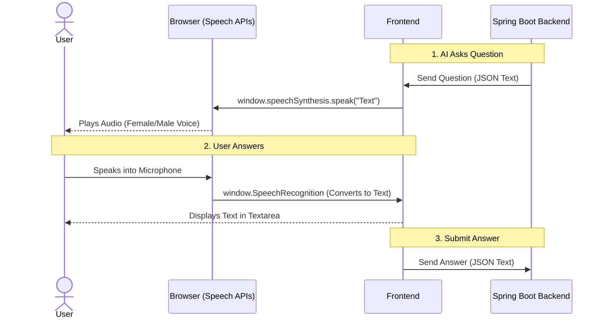
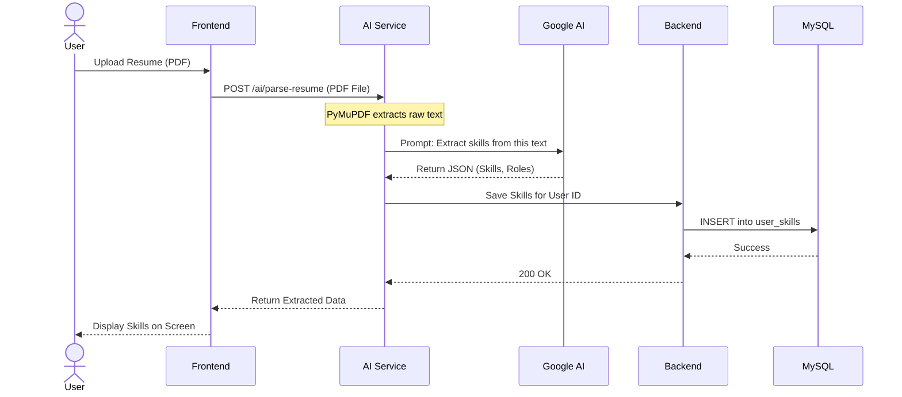
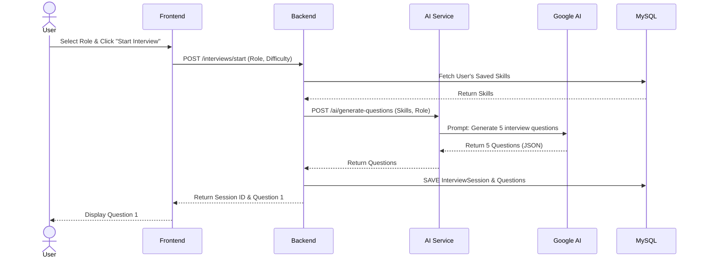
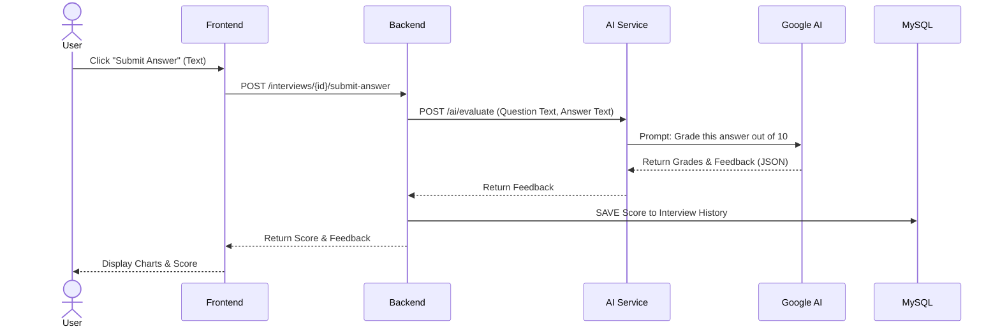
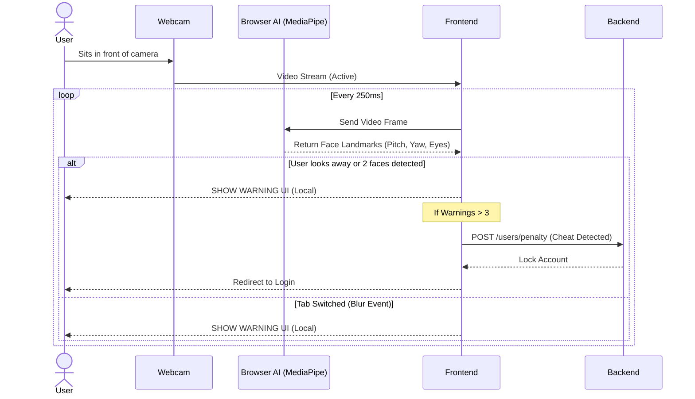

# InterviewIQ Workflows & AI Communication

This document contains visual diagrams mapping out the exact data flow for every major feature in your platform. These diagrams are excellent for visual learners and are highly recommended for technical interviews to demonstrate your understanding of system architecture.

## 1. AI Voice & Text Communication Flow (The Illusion)

This diagram shows how you achieve "voice-to-voice" communication without sending heavy audio files to the server.

---

## 2. Resume Upload & Skill Assessment Flow

How a PDF becomes structured skill data in the database.

---

## 3. Interview Question Generation Flow

How the system dynamically creates tailored questions.

---

## 4. Answer Evaluation Workflow

How an answer is graded in real-time.

---

## 5. Live Mock Interview & Proctoring Flow

How the frontend uses local AI to detect cheating without hitting the server.

